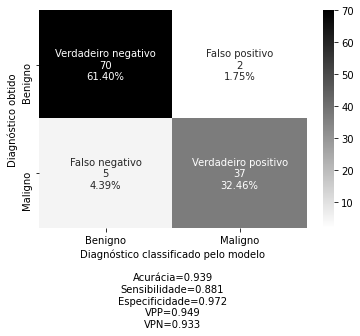

# Introdução a Machine Learning com Data Girls

**Aqui colocaremos em prática os conceitos de Regressão Logística abordados na apresentação teórica.**

**Mãos à obra!** 


## Sobre os dados

O problema está relacionado com características obtidas a partir de imagens digitalizadas de um exame mamário. Foram extraídas 10 características a partir dos núcleos de células de 569 imagens, sendo estas:

* raio (média das distâncias do centro para os pontos no perímetro), 
* textura (desvio padrão dos valores de escala de cinza), 
* perímetro, 
* área, 
* suavidade (variação local em comprimentos de raio), 
* compacidade ($\text{perímetro}^2$ / área - 1), 
* concavidade (gravidade das porções côncavas do contorno), 
* pontos côncavos (número de porções côncavas do contorno),
* simetria,
* dimensão fractal (aproximação costeira - 1).

Três medidas descritivas foram calculadas para os resultados de cada imagem, a média, desvio-padrão e a média dos três maiores valores. Dessa forma, obtemos 30 variáveis preditoras de natureza contínua. A variável resposta é o diagnóstico da paciente referente ao câncer de mama, que pode ser maligno ou benigno. O interesse então é criar um modelo para classificar novas pacientes a partir das variáveis obtidas. 

A descrição do conjunto de dados e outras informações podem ser obtidos em [UCI Machine Learning](http://archive.ics.uci.edu/ml/datasets/breast+cancer+wisconsin+%28diagnostic%29)


## Importação


```
# Importar bibliotecas para uso inicial

# Manipulação dos dados
import pandas as pd
import numpy as np

# Visualização gráfica
import matplotlib.pyplot as plt
import seaborn as sns

# Remover os avisos
import warnings
warnings.filterwarnings('ignore')
```

**O download do nosso conjunto de dados é realizado através da função abaixo no respectivo link.**


```
# Importando os dados a serem trabalhados 

dados = pd.read_csv("https://docs.google.com/spreadsheets/d/1-FQHT53HTtT-lJgHx2TA6GhzeyvgKB2XWvue57hb4M4/export?format=csv")

```

**Identificar o formato dos dados e a dimensão é fundamental para as próximas etapas.**


```
# Dimensão da base de dados

dados.shape # (linhas, colunas)
```


    (569, 31)


```
# Formato dos dados

dados.head() 

# linhas = pacientes 
# colunas = variáveis
```


<div>
<style scoped>
    .dataframe tbody tr th:only-of-type {
        vertical-align: middle;
    }

    .dataframe tbody tr th {
        vertical-align: top;
    }

    .dataframe thead th {
        text-align: right;
    }
</style>
<table border="1" class="dataframe">
  <thead>
    <tr style="text-align: right;">
      <th></th>
      <th>id</th>
      <th>diagnosis</th>
      <th>radius_mean</th>
      <th>texture_mean</th>
      <th>perimeter_mean</th>
      <th>area_mean</th>
      <th>smoothness_mean</th>
      <th>compactness_mean</th>
      <th>concavity_mean</th>
      <th>concave points_mean</th>
      <th>symmetry_mean</th>
      <th>fractal_dimension_mean</th>
      <th>radius_se</th>
      <th>texture_se</th>
      <th>perimeter_se</th>
      <th>area_se</th>
      <th>smoothness_se</th>
      <th>compactness_se</th>
      <th>concavity_se</th>
      <th>concave points_se</th>
      <th>symmetry_se</th>
      <th>fractal_dimension_se</th>
      <th>radius_worst</th>
      <th>texture_worst</th>
      <th>perimeter_worst</th>
      <th>area_worst</th>
      <th>smoothness_worst</th>
      <th>compactness_worst</th>
      <th>concavity_worst</th>
      <th>concave points_worst</th>
      <th>symmetry_worst</th>
      <th>fractal_dimension_worst</th>
    </tr>
  </thead>
  <tbody>
    <tr>
      <th>0</th>
      <td>842302</td>
      <td>M</td>
      <td>17.99</td>
      <td>10.38</td>
      <td>122.80</td>
      <td>1001.0</td>
      <td>1.184</td>
      <td>2.776</td>
      <td>3.001</td>
      <td>1.471</td>
      <td>2.419</td>
      <td>7.871</td>
      <td>1.095</td>
      <td>9.053</td>
      <td>8.589</td>
      <td>153.40</td>
      <td>6.399</td>
      <td>4.904</td>
      <td>5.373</td>
      <td>1.587</td>
      <td>3.003</td>
      <td>6.193</td>
      <td>25.38</td>
      <td>17.33</td>
      <td>184.60</td>
      <td>2019.0</td>
      <td>1.622</td>
      <td>6.656</td>
      <td>7.119</td>
      <td>2.654</td>
      <td>4.601</td>
      <td>1.189</td>
    </tr>
    <tr>
      <th>1</th>
      <td>842517</td>
      <td>M</td>
      <td>20.57</td>
      <td>17.77</td>
      <td>132.90</td>
      <td>1326.0</td>
      <td>8.474</td>
      <td>7.864</td>
      <td>869.000</td>
      <td>7.017</td>
      <td>1.812</td>
      <td>5.667</td>
      <td>5.435</td>
      <td>7.339</td>
      <td>3.398</td>
      <td>74.08</td>
      <td>5.225</td>
      <td>1.308</td>
      <td>186.000</td>
      <td>134.000</td>
      <td>1.389</td>
      <td>3.532</td>
      <td>24.99</td>
      <td>23.41</td>
      <td>158.80</td>
      <td>1956.0</td>
      <td>1.238</td>
      <td>1.866</td>
      <td>2.416</td>
      <td>186.000</td>
      <td>275.000</td>
      <td>8.902</td>
    </tr>
    <tr>
      <th>2</th>
      <td>84300903</td>
      <td>M</td>
      <td>19.69</td>
      <td>21.25</td>
      <td>130.00</td>
      <td>1203.0</td>
      <td>1.096</td>
      <td>1.599</td>
      <td>1.974</td>
      <td>1.279</td>
      <td>2.069</td>
      <td>5.999</td>
      <td>7.456</td>
      <td>7.869</td>
      <td>4.585</td>
      <td>94.03</td>
      <td>615.000</td>
      <td>4.006</td>
      <td>3.832</td>
      <td>2.058</td>
      <td>225.000</td>
      <td>4.571</td>
      <td>23.57</td>
      <td>25.53</td>
      <td>152.50</td>
      <td>1709.0</td>
      <td>1.444</td>
      <td>4.245</td>
      <td>4.504</td>
      <td>243.000</td>
      <td>3.613</td>
      <td>8.758</td>
    </tr>
    <tr>
      <th>3</th>
      <td>84348301</td>
      <td>M</td>
      <td>11.42</td>
      <td>20.38</td>
      <td>77.58</td>
      <td>386.1</td>
      <td>1.425</td>
      <td>2.839</td>
      <td>2.414</td>
      <td>1.052</td>
      <td>2.597</td>
      <td>9.744</td>
      <td>4.956</td>
      <td>1.156</td>
      <td>3.445</td>
      <td>27.23</td>
      <td>911.000</td>
      <td>7.458</td>
      <td>5.661</td>
      <td>1.867</td>
      <td>5.963</td>
      <td>9.208</td>
      <td>14.91</td>
      <td>26.50</td>
      <td>98.87</td>
      <td>567.7</td>
      <td>2.098</td>
      <td>8.663</td>
      <td>6.869</td>
      <td>2.575</td>
      <td>6.638</td>
      <td>173.000</td>
    </tr>
    <tr>
      <th>4</th>
      <td>84358402</td>
      <td>M</td>
      <td>20.29</td>
      <td>14.34</td>
      <td>135.10</td>
      <td>1297.0</td>
      <td>1.003</td>
      <td>1.328</td>
      <td>198.000</td>
      <td>1.043</td>
      <td>1.809</td>
      <td>5.883</td>
      <td>7.572</td>
      <td>7.813</td>
      <td>5.438</td>
      <td>94.44</td>
      <td>1.149</td>
      <td>2.461</td>
      <td>5.688</td>
      <td>1.885</td>
      <td>1.756</td>
      <td>5.115</td>
      <td>22.54</td>
      <td>16.67</td>
      <td>152.20</td>
      <td>1575.0</td>
      <td>1.374</td>
      <td>205.000</td>
      <td>0.400</td>
      <td>1.625</td>
      <td>2.364</td>
      <td>7.678</td>
    </tr>
  </tbody>
</table>
</div>


**Vamos transformar a variável `id` no índice das linhas**


```
dados.set_index("id", inplace=True)
```

**O uso do parâmetro**

```
inplace=True
```
**nos garante que a alteração será feita no conjunto de dados**


```
dados.head() 
```


<div>
<style scoped>
    .dataframe tbody tr th:only-of-type {
        vertical-align: middle;
    }

    .dataframe tbody tr th {
        vertical-align: top;
    }

    .dataframe thead th {
        text-align: right;
    }
</style>
<table border="1" class="dataframe">
  <thead>
    <tr style="text-align: right;">
      <th></th>
      <th>diagnosis</th>
      <th>radius_mean</th>
      <th>texture_mean</th>
      <th>perimeter_mean</th>
      <th>area_mean</th>
      <th>smoothness_mean</th>
      <th>compactness_mean</th>
      <th>concavity_mean</th>
      <th>concave points_mean</th>
      <th>symmetry_mean</th>
      <th>fractal_dimension_mean</th>
      <th>radius_se</th>
      <th>texture_se</th>
      <th>perimeter_se</th>
      <th>area_se</th>
      <th>smoothness_se</th>
      <th>compactness_se</th>
      <th>concavity_se</th>
      <th>concave points_se</th>
      <th>symmetry_se</th>
      <th>fractal_dimension_se</th>
      <th>radius_worst</th>
      <th>texture_worst</th>
      <th>perimeter_worst</th>
      <th>area_worst</th>
      <th>smoothness_worst</th>
      <th>compactness_worst</th>
      <th>concavity_worst</th>
      <th>concave points_worst</th>
      <th>symmetry_worst</th>
      <th>fractal_dimension_worst</th>
    </tr>
    <tr>
      <th>id</th>
      <th></th>
      <th></th>
      <th></th>
      <th></th>
      <th></th>
      <th></th>
      <th></th>
      <th></th>
      <th></th>
      <th></th>
      <th></th>
      <th></th>
      <th></th>
      <th></th>
      <th></th>
      <th></th>
      <th></th>
      <th></th>
      <th></th>
      <th></th>
      <th></th>
      <th></th>
      <th></th>
      <th></th>
      <th></th>
      <th></th>
      <th></th>
      <th></th>
      <th></th>
      <th></th>
      <th></th>
    </tr>
  </thead>
  <tbody>
    <tr>
      <th>842302</th>
      <td>M</td>
      <td>17.99</td>
      <td>10.38</td>
      <td>122.80</td>
      <td>1001.0</td>
      <td>1.184</td>
      <td>2.776</td>
      <td>3.001</td>
      <td>1.471</td>
      <td>2.419</td>
      <td>7.871</td>
      <td>1.095</td>
      <td>9.053</td>
      <td>8.589</td>
      <td>153.40</td>
      <td>6.399</td>
      <td>4.904</td>
      <td>5.373</td>
      <td>1.587</td>
      <td>3.003</td>
      <td>6.193</td>
      <td>25.38</td>
      <td>17.33</td>
      <td>184.60</td>
      <td>2019.0</td>
      <td>1.622</td>
      <td>6.656</td>
      <td>7.119</td>
      <td>2.654</td>
      <td>4.601</td>
      <td>1.189</td>
    </tr>
    <tr>
      <th>842517</th>
      <td>M</td>
      <td>20.57</td>
      <td>17.77</td>
      <td>132.90</td>
      <td>1326.0</td>
      <td>8.474</td>
      <td>7.864</td>
      <td>869.000</td>
      <td>7.017</td>
      <td>1.812</td>
      <td>5.667</td>
      <td>5.435</td>
      <td>7.339</td>
      <td>3.398</td>
      <td>74.08</td>
      <td>5.225</td>
      <td>1.308</td>
      <td>186.000</td>
      <td>134.000</td>
      <td>1.389</td>
      <td>3.532</td>
      <td>24.99</td>
      <td>23.41</td>
      <td>158.80</td>
      <td>1956.0</td>
      <td>1.238</td>
      <td>1.866</td>
      <td>2.416</td>
      <td>186.000</td>
      <td>275.000</td>
      <td>8.902</td>
    </tr>
    <tr>
      <th>84300903</th>
      <td>M</td>
      <td>19.69</td>
      <td>21.25</td>
      <td>130.00</td>
      <td>1203.0</td>
      <td>1.096</td>
      <td>1.599</td>
      <td>1.974</td>
      <td>1.279</td>
      <td>2.069</td>
      <td>5.999</td>
      <td>7.456</td>
      <td>7.869</td>
      <td>4.585</td>
      <td>94.03</td>
      <td>615.000</td>
      <td>4.006</td>
      <td>3.832</td>
      <td>2.058</td>
      <td>225.000</td>
      <td>4.571</td>
      <td>23.57</td>
      <td>25.53</td>
      <td>152.50</td>
      <td>1709.0</td>
      <td>1.444</td>
      <td>4.245</td>
      <td>4.504</td>
      <td>243.000</td>
      <td>3.613</td>
      <td>8.758</td>
    </tr>
    <tr>
      <th>84348301</th>
      <td>M</td>
      <td>11.42</td>
      <td>20.38</td>
      <td>77.58</td>
      <td>386.1</td>
      <td>1.425</td>
      <td>2.839</td>
      <td>2.414</td>
      <td>1.052</td>
      <td>2.597</td>
      <td>9.744</td>
      <td>4.956</td>
      <td>1.156</td>
      <td>3.445</td>
      <td>27.23</td>
      <td>911.000</td>
      <td>7.458</td>
      <td>5.661</td>
      <td>1.867</td>
      <td>5.963</td>
      <td>9.208</td>
      <td>14.91</td>
      <td>26.50</td>
      <td>98.87</td>
      <td>567.7</td>
      <td>2.098</td>
      <td>8.663</td>
      <td>6.869</td>
      <td>2.575</td>
      <td>6.638</td>
      <td>173.000</td>
    </tr>
    <tr>
      <th>84358402</th>
      <td>M</td>
      <td>20.29</td>
      <td>14.34</td>
      <td>135.10</td>
      <td>1297.0</td>
      <td>1.003</td>
      <td>1.328</td>
      <td>198.000</td>
      <td>1.043</td>
      <td>1.809</td>
      <td>5.883</td>
      <td>7.572</td>
      <td>7.813</td>
      <td>5.438</td>
      <td>94.44</td>
      <td>1.149</td>
      <td>2.461</td>
      <td>5.688</td>
      <td>1.885</td>
      <td>1.756</td>
      <td>5.115</td>
      <td>22.54</td>
      <td>16.67</td>
      <td>152.20</td>
      <td>1575.0</td>
      <td>1.374</td>
      <td>205.000</td>
      <td>0.400</td>
      <td>1.625</td>
      <td>2.364</td>
      <td>7.678</td>
    </tr>
  </tbody>
</table>
</div>


## Análise exploratória

**Vamos avaliar se existem valores faltantes e/ou linhas duplicadas na base de dados**

### Valores faltantes


```
# Valores nulos e tipo de variável

dados.info()
```

    <class 'pandas.core.frame.DataFrame'>
    Int64Index: 569 entries, 842302 to 92751
    Data columns (total 31 columns):
     #   Column                   Non-Null Count  Dtype  
    ---  ------                   --------------  -----  
     0   diagnosis                569 non-null    object 
     1   radius_mean              569 non-null    float64
     2   texture_mean             569 non-null    float64
     3   perimeter_mean           569 non-null    float64
     4   area_mean                569 non-null    float64
     5   smoothness_mean          569 non-null    float64
     6   compactness_mean         569 non-null    float64
     7   concavity_mean           569 non-null    float64
     8   concave points_mean      569 non-null    float64
     9   symmetry_mean            569 non-null    float64
     10  fractal_dimension_mean   569 non-null    float64
     11  radius_se                569 non-null    float64
     12  texture_se               569 non-null    float64
     13  perimeter_se             569 non-null    float64
     14  area_se                  569 non-null    float64
     15  smoothness_se            569 non-null    float64
     16  compactness_se           569 non-null    float64
     17  concavity_se             569 non-null    float64
     18  concave points_se        569 non-null    float64
     19  symmetry_se              569 non-null    float64
     20  fractal_dimension_se     569 non-null    float64
     21  radius_worst             569 non-null    float64
     22  texture_worst            569 non-null    float64
     23  perimeter_worst          569 non-null    float64
     24  area_worst               569 non-null    float64
     25  smoothness_worst         569 non-null    float64
     26  compactness_worst        569 non-null    float64
     27  concavity_worst          569 non-null    float64
     28  concave points_worst     569 non-null    float64
     29  symmetry_worst           569 non-null    float64
     30  fractal_dimension_worst  569 non-null    float64
    dtypes: float64(30), object(1)
    memory usage: 142.2+ KB


**Neste caso não temos valores faltantes no conjunto de dados, pois a quantidade de linhas não nulas pra cada variável é a mesma quantidade de linhas do conjunto de dados.**

**Caso houvessem valores faltantes, estes poderiam ser removidos ou aplicada alguma técnica para substituí-los (imputação de dados). Link para saber mais: [Como lidar com valores faltantes](https://portaldatascience.com/como-lidar-com-valores-faltantes-missing/)**

### Duplicatas


**Verificaremos se as linhas possuem duplicação, de forma que para cada linha do conjunto de dados um valor lógico indicando se ela possui duplicação ou não é associado.**


```
dados.duplicated() 
```


    id
    842302      False
    842517      False
    84300903    False
    84348301    False
    84358402    False
                ...  
    926424      False
    926682      False
    926954      False
    927241      False
    92751       False
    Length: 569, dtype: bool


**Abaixo estamos somando valores lógicos `TRUE` e `FALSE`, equivalente a 1 e 0, respectivamente.**


```
dados.duplicated().sum()
```


    0


**Como nosso resultado foi 0, significa que todos os valores foram `FALSE`, sendo assim o conjunto de dados limpo de duplicações.**

### Variável dependente

**Vamos realizar a contagem da variável dependente do nosso problema - `diagnosis` - que trata-se do diagnóstico do câncer de mama das pacientes, podendo ser benigno ou maligno (`B` ou `M`). Caso o diagnóstico seja maligno, é positivo para a doença.**


```
dados.groupby('diagnosis')['diagnosis'].count()
```


    diagnosis
    B    357
    M    212
    Name: diagnosis, dtype: int64


**Em tarefas de classificação essa etapa é importante para identificar possíveis problemas com desbalanceamento e alternativas para resolvê-los. Link para saber mais: [Como lidar com dados desbalanceados em problemas de classificação](https://medium.com/data-hackers/como-lidar-com-dados-desbalanceados-em-problemas-de-classifica%C3%A7%C3%A3o-17c4d4357ef9)**


### Pacote `sweetviz`

**Para analisar as variáveis bem como suas relações, vamos utilizar o pacote `sweetviz` que possui algumas funções capazes de fazer comparações entre conjuntos de dados, ou mesmo comparar grupos, entregando como resultado um documento html completo, com as visualizações gráficas das variáveis.**


```
# !pip install sweetviz
# import sweetviz as sv
```


```
# Análise geral

# analise = sv.analyze(dados)
# analise.show_html("EDA.html")
```


```
# Análise por diagnóstico

# compare_diag = sv.compare_intra(dados, dados['diagnosis']=='B',['Benigno','Maligno'])
# compare_diag.show_html('EDA_diagnosis.html')
```

## Modelagem


### Pré-processamento


```
# Função para dividir os dados em treino e teste
from sklearn.model_selection import train_test_split

# Função para padronizar os dados
from sklearn.preprocessing import StandardScaler
```

**Dividindo o conjunto de dados em treino e teste**


```
X = dados.drop(['diagnosis'], axis = 1) # variáveis independentes
```


```
y = dados[['diagnosis']] # variável dependente
```


```
# O parâmetro random_state é essencial para garantir a reprodutibilidade dos resultados
X_train, X_test, y_train, y_test = train_test_split(X, y, test_size = 0.2, random_state = 23102020)
```


```
print(y_train.groupby('diagnosis')['diagnosis'].count())
print(X_train.shape)
```

    diagnosis
    B    285
    M    170
    Name: diagnosis, dtype: int64
    (455, 30)


**Transformando os dados utilizando a padronização**


```
std_scale = StandardScaler()
X_train_std = std_scale.fit_transform(X_train)
X_test_std  = std_scale.transform(X_test)
```

### Regressão logística


```
# Função para realizar a regressão logística
from sklearn.linear_model import LogisticRegression
```

**Aplicando o modelo ao conjunto de treino e classificando os dados de teste em benigno ou maligno**


```
logreg = LogisticRegression()
logreg.fit(X_train_std , y_train)
predictions = logreg.predict(X_test_std)
```

### Avaliação


```
# Para visualização dos resultados e cáculo das métricas de desemepenho
from sklearn.metrics import confusion_matrix
```

**A função abaixo completa foi encontrada em [Visualização da matriz de confusão](https://medium.com/@dtuk81/confusion-matrix-visualization-fc31e3f30fea)**


```
# Função para construir a Matriz de confusão

def make_confusion_matrix(cf,
                          group_names=None,
                          categories='auto',
                          count=True,
                          percent=True,
                          cbar=True,
                          xyticks=True,
                          xyplotlabels=True,
                          sum_stats=True,
                          figsize=None,
                          cmap='Blues',
                          title=None):

    # CODE TO GENERATE TEXT INSIDE EACH SQUARE
    blanks = ['' for i in range(cf.size)]

    if group_names and len(group_names)==cf.size:
        group_labels = ["{}\n".format(value) for value in group_names]
    else:
        group_labels = blanks

    if count:
        group_counts = ["{0:0.0f}\n".format(value) for value in cf.flatten()]
    else:
        group_counts = blanks

    if percent:
        group_percentages = ["{0:.2%}".format(value) for value in cf.flatten()/np.sum(cf)]
    else:
        group_percentages = blanks

    box_labels = [f"{v1}{v2}{v3}".strip() for v1, v2, v3 in zip(group_labels,group_counts,group_percentages)]
    box_labels = np.asarray(box_labels).reshape(cf.shape[0],cf.shape[1])

     # CODE TO GENERATE SUMMARY STATISTICS & TEXT FOR SUMMARY STATS
    if sum_stats:
        #Accuracy is sum of diagonal divided by total observations
        acuracia  = np.trace(cf) / float(np.sum(cf))

        #if it is a binary confusion matrix, show some more stats
        if len(cf)==2:
            #Metrics for Binary Confusion Matrices
            sensibilidade = cf[1,1]/sum(cf[1,:])
            especificidade = cf[0,0]/sum(cf[0,:])
            VPP = cf[1,1] / sum(cf[:,1])
            VPN = cf[0,0] / sum(cf[:,0])
            # f1_score  = 2*precision*recall / (precision + recall)
            stats_text = "\n\nAcurácia={:0.3f}\nSensibilidade={:0.3f}\nEspecificidade={:0.3f}\nVPP={:0.3f}\nVPN={:0.3f}".format(
                acuracia, sensibilidade, especificidade, VPP, VPN)
        else:
            stats_text = "\n\nnAcurácia={:0.3f}".format(acuracia)
    else:
        stats_text = ""

    # SET FIGURE PARAMETERS ACCORDING TO OTHER ARGUMENTS
    if figsize==None:
        #Get default figure size if not set
        figsize = plt.rcParams.get('figure.figsize')

    if xyticks==False:
        #Do not show categories if xyticks is False
        categories=False

    # MAKE THE HEATMAP VISUALIZATION
    plt.figure(figsize=figsize)
    sns.heatmap(cf,annot=box_labels,fmt="",cmap=cmap,cbar=cbar,xticklabels=categories,yticklabels=categories)

    if xyplotlabels:
        plt.ylabel('Diagnóstico obtido');
        plt.xlabel('Diagnóstico classificado pelo modelo' + stats_text)
    else:
        plt.xlabel(stats_text)
    
    if title:
        plt.title(title)
```

**Verificando os resultados observados e classificados**


```
# Quantidade pra cada diagnóstico no conjunto de teste
y_test.groupby('diagnosis')['diagnosis'].count()
```


    diagnosis
    B    72
    M    42
    Name: diagnosis, dtype: int64


```
# Quantidade pra cada diagnóstico classficado pelo modelo
print('B   ', np.count_nonzero(predictions=='B'))
print('M   ', np.count_nonzero(predictions=='M'))
```

    B    75
    M    39


```
cm = confusion_matrix(y_test, predictions); cm
```


    array([[70,  2],
           [ 5, 37]])


**A matriz mostra o resultado observado no conjunto de teste (linha) contra o resultado obtido pela classificação (coluna), como também as métricas necessárias para avaliar o desempenho do modelo**


```
labels = ['Verdadeiro negativo','Falso positivo','Falso negativo', 'Verdadeiro positivo']
diagnosticos = ['Benigno', 'Maligno']
make_confusion_matrix(cm, 
                      group_names=labels,
                      categories=diagnosticos, 
                      cmap='binary')
```





## Dicas de aprofundamento

**Pra quem deseja aprofundar os conhecimentos em *Machine Learning* e/ou melhorar o desempenho do modelo, seguem algumas dicas (alguns tópicos exigem pré-requisitos)**

* Métodos de seleção de variável - 

  *   [Seleção de variável em python](https://medium.com/@alegeorgelustosa/m%C3%A9todos-para-selecionar-as-melhores-vari%C3%A1veis-do-dataset-em-python-2c374b2e9df2)

  *   [Aprenda a selecionar variáveis para o modelo de ML](https://minerandodados.com.br/aprenda-como-selecionar-features-para-seu-modelo-de-machine-learning/) 

* Validação cruzada - [Validação cruzada aprenda de forma simples](https://minerandodados.com.br/validacao-cruzada-aprenda-de-forma-simples-como-usar-essa-tecnica/)

* Outros modelos de classificação - [Types of classification in ML](https://machinelearningmastery.com/types-of-classification-in-machine-learning/)

* Redes neurais - [Build your own neural newtwork for beginners](https://towardsdatascience.com/how-to-build-your-own-neural-network-from-scratch-in-python-68998a08e4f6)

* Otimização do modelo - [Tuning with python step by step](https://towardsdatascience.com/hyperparameter-tuning-with-python-keras-xgboost-guide-7cb3ef480f9c)

* Modelo de regressão - [Regressões em Python](https://imasters.com.br/back-end/data-science-regressoes-com-python)


```

```
